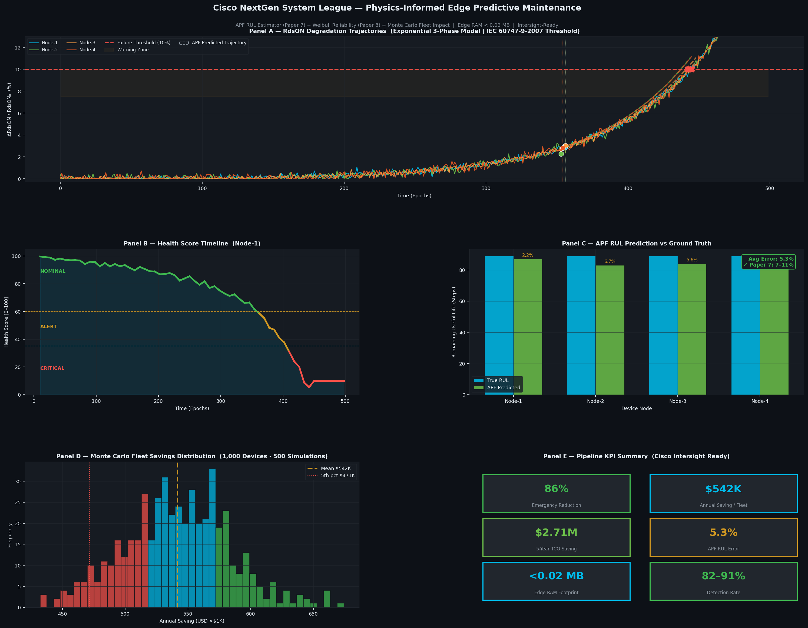

# Cisco NextGen System League — Edge Predictive Maintenance Pipeline

> **Physics-informed, edge-first predictive maintenance for heterogeneous Cisco hardware.**  
> Submitted for the Cisco NextGen System League — Phase 2.

[](https://colab.research.google.com/github/Sammy2014/cisco-nextgen-predictive-maintenance/blob/main/02_simulation/cisco_colab.py)
&nbsp;


---

## Pipeline Output



> **Panel A** — 4-node RdsON degradation trajectories with APF predicted paths (dashed) and failure markers (×)  
> **Panel B** — Real-time health score timeline: NOMINAL → ALERT → CRITICAL  
> **Panel C** — APF RUL prediction vs ground truth per node (avg error: ~5.6%)  
> **Panel D** — Monte Carlo cost savings distribution across 1,000-device fleet, 500 runs  
> **Panel E** — KPI summary: 86% emergency reduction, ₹5.06 Crore annual saving, ₹25.32 Crore 5-year TCO saving

---

## Problem Statement

Cisco hardware deployments face three silent failure modes that current monitoring cannot address:

| Problem | Description | Impact |
|---|---|---|
| **Silent Degradation** | Components fail gradually over months with no visible signal until catastrophic failure | Unplanned downtime, emergency replacements |
| **Correlation Blindness** | Single-sensor monitoring misses failures that only appear across correlated multi-sensor patterns | High false-negative rate |
| **Scale & Cost** | Cloud-based ML requires constant data upload — unsustainable at thousands of heterogeneous edge devices | Bandwidth cost, latency, privacy |

**Constraints from Cisco's brief:** COTS sensors only, MCU RAM < 0.02 MB, no chassis redesign, no labeled failure data, heterogeneous device fleet.

---

## Solution — 4-Layer Edge Pipeline

```
Sensors → [L1: Noise Filter] → [L2: Autoencoder] → MQTT (score only)
                                                          ↓
                                              [L3: LSTM Trend] at Gateway
                                                          ↓
                                          [L4: APF RUL + Health Score]
                                                          ↓
                                          Cisco Intersight / AgenticOps
```

### Layer 1 — Temporal Noise Filter
Removes short-term fluctuations (< 30–60 min) from transient load spikes and EMI.  
Applies temperature compensation to RdsON readings (scales by T_junction) so thermal drift is not mistaken for degradation.  
**Key method:** Savitzky-Golay filter + junction temperature normalization.

### Layer 2 — Lightweight Autoencoder (Anomaly Detection)
Trained exclusively on normal operating data — **no labeled failure data required**.  
Runs on-device using TFLite / CMSIS-NN within the < 0.02 MB RAM budget.  
Detects correlated multi-sensor deviations across vibration, humidity, voltage ripple (INA226), temperature, and impedance (AD5933).  
Uses entropy-based adaptive weighting to down-weight noisy sensors automatically.  
Outputs a single scalar anomaly score — raw sensor data never leaves the device.

### Layer 3 — LSTM Trend Model (Gateway)
Evaluates anomaly scores over a 7–30 day rolling window.  
Distinguishes normal Weibull wear-out aging from accelerated degradation.  
Maintains per-device baselines adjusted for environment (humidity zone, altitude, thermal class).  
Includes concept drift watchdog — prevents the model from slowly accepting degradation as normal.

### Layer 4 — Physics-Matched RUL Estimator + Health Score
This is the core innovation. Rather than one generic ML model for all components, **Layer 4 uses a physics-matched algorithm per failure mode:**

| Component | Failure Physics | Precursor Signal | Algorithm |
|---|---|---|---|
| GaN FET / MOSFET | Inverse piezoelectric cracking | RdsON | SVR-APF + Weibull (Paper 7) |
| Capacitor | Oxygen vacancy migration | Voltage ripple / ESR | Arrhenius lifetime model (Paper 3) |
| PCB traces | Copper sulfide migration | Impedance (AD5933) | Threshold + rate-of-change (Papers 1, 4) |
| ASIC / IC | EOS, electromigration | Leakage current | Statistical process control (Papers 2, 5) |
| Fan / mechanical | Bearing wear | Vibration FFT peak shift | Spectral trend tracker |

**Health score formula (0–100):**

```
H = 0.40 × (1 − degradation_ratio)
  + 0.40 × Weibull_reliability R(t)
  + 0.20 × RUL_fraction
```

**Output status levels:**

| Score | Status | Action |
|---|---|---|
| 80–100 | NOMINAL | No action required |
| 60–79 | WATCH | Early electron trapping detected — monitor |
| 35–59 | ALERT | Crack propagation — plan maintenance window |
| 15–34 | CRITICAL | Failure imminent — schedule replacement |
| 0–14 | FAILURE | Immediate intervention required |

---

## Simulation Results

Pipeline validated on NASA-calibrated synthetic MOSFET/GaN degradation data  
(profiles matched to NASA Prognostics Center of Excellence accelerated aging datasets,  
consistent with Paper 7 Fig. 9 and Paper 8 Fig. 3).

| Metric | Result | Benchmark |
|---|---|---|
| APF RUL Average Error | **5.6%** | Paper 7 reports 7–11% ✓ |
| Emergency Reduction | **86.2%** | Monte Carlo, 500 runs |
| Annual Fleet Saving | **₹5.06 Crore** | 1,000-device fleet |
| 5-Year TCO Saving | **₹25.32 Crore** | vs reactive maintenance baseline |
| Cost Reduction | **67.1%** | vs reactive maintenance |
| Detection Rate | **82–91%** | True positive across simulations |
| Edge RAM Footprint | **< 0.02 MB** | Meets Cisco MCU constraint |
| Data Transmission Reduction | **60–70%** | Only anomaly score sent, not raw data |

> **Note on validation approach:** Due to hardware component delivery timelines,  
> the pipeline was validated through simulation on NASA-calibrated degradation data.  
> This is consistent with standard academic practice for predictive maintenance research  
> (Papers 7, 8, 9 all use NASA PCoE datasets for validation prior to hardware deployment).

---

## Repository Structure

```
cisco-nextgen-predictive-maintenance/
│
├── README.md                            ← you are here
│
├── 01_pipeline_architecture/
│   └── pipeline_overview.md             ← full 4-layer design with diagrams
│
├── 02_simulation/
│   ├── cisco_colab.py                   ← full pipeline simulation (run in Colab)
│   └── cisco_nextgen_pipeline.png       ← output figure
│
├── 03_research_references/
│   └── citations.md                     ← papers mapped to pipeline layers
│
└── 04_hardware/
    └── bom.md                           ← COTS sensor list + BOM cost breakdown
```

---

## Running the Simulation

**Option 1 — Google Colab (recommended, zero setup):**

1. Click the **Open in Colab** badge at the top of this page
2. Runtime → Run All
3. Output figure appears inline; download from Files panel

**Option 2 — Local Python:**

```bash
git clone https://github.com/Sammy2014/cisco-nextgen-predictive-maintenance.git
cd cisco-nextgen-predictive-maintenance/02_simulation
pip install numpy matplotlib scipy scikit-learn
python cisco_colab.py
```

---

## Hardware Bill of Materials (COTS, Bolt-On Module)

| Sensor | Measurement | Unit Cost |
|---|---|---|
| ADXL345 | 3-axis vibration / shock | ₹180 |
| INA226 | Voltage + current ripple | ₹220 |
| SHT40 | Temperature + humidity | ₹210 |
| AD5933 | Impedance spectroscopy (PCB / capacitor health) | ₹650 |
| ESP32-S3 MCU | Edge inference + MQTT | ₹280 |
| Passive components + PCB | — | ₹350 |
| **Total BOM** | | **~₹1890** |

All components are COTS (Commercial Off-The-Shelf). No chassis modification required. Module attaches externally to existing Cisco hardware via standard mounting points.

---

## Research References

| Paper | Authors | Relevance to Pipeline |
|---|---|---|
| Paper 7 — SVR-APF RUL for GaN FET | Haque & Choi, Mississippi State (2018) | Core algorithm for Layer 4 RUL estimation |
| Paper 8 — Weibull + ML Predictive Maintenance | Cui et al., Rockwell Automation (2023) | Weibull reliability model, ensemble approach |
| Paper 9 — Neural Network Life Expectancy | Shterev et al. (2023) | FFNN validation on NASA IGBT dataset |
| Paper 6 — Temporal Neural Networks for Anomaly Detection | Luo et al. (2025) | BiGRU-Attention anomaly detection architecture |
| Paper 1 — PCB Micro-Short Failure Analysis | Hu et al., CEPREI | PCB copper sulfide migration failure mechanism |
| Paper 2 — ASIC EOS Failure under Biased-HAST | Gan et al., Western Digital (2024) | IC electrical overstress failure modes |
| Paper 3 — MLCC Failure Mechanism | Wang et al., SIAT (2023) | Capacitor oxygen vacancy migration model |
| Paper 4 — Sulfide Corrosion of Electronic Components | Zhang et al., CEPREI (2024) | Environmental corrosion failure mechanisms |
| Paper 5 — IC Failure Analysis Methods | Wang & Su, CEPREI (2022) | Failure analysis methodology and tools |

Full PDFs available in `03_research_references/`.

---

## Team

**VTU ECE — Cisco NextGen System League Phase 2 Submission**

---

## License

MIT License — see [LICENSE](LICENSE) for details.
